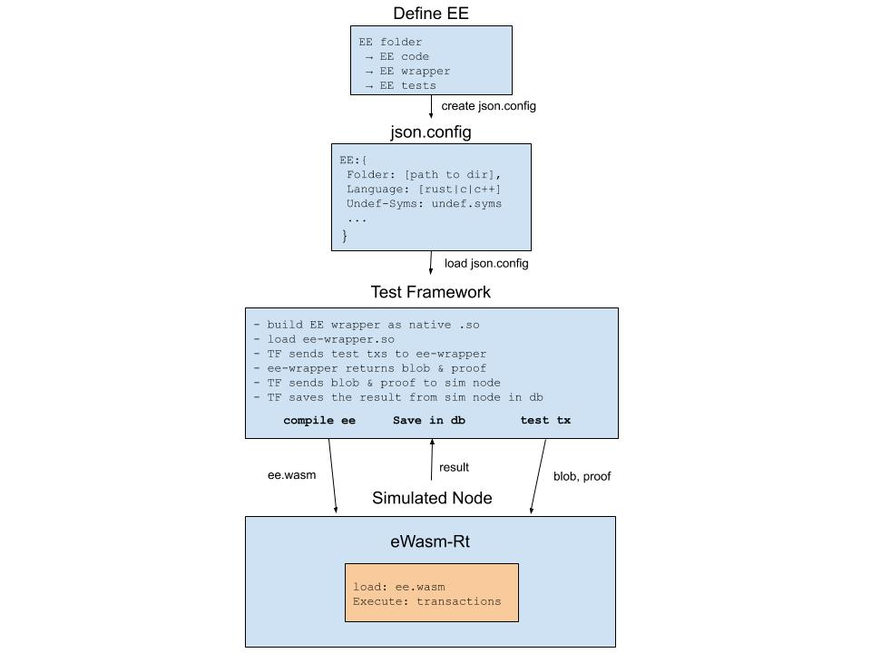

# Roadmap

The plan is to take an iterative approach to the development of EE Tooling.  Each iteration will begin by looking at the existing process, creating a plan to address existing issues and defining a worksplit.

## Iteration 1

### Current EE Development Experience 

1) Pick a language: Rust, Assembly Script, C, C++, etc
2) Write the code for your EE:
    i. define memory layout: SSZ, Solidity-style, etc
    ii. define proof backend (localdb): Sparse Merkle Trees, Merkle Patricia Trees, Binary Trees, etc
    iii. define initial state and initialize the db 
3) Define a custom build process to generate wasm.
4) Execute in a runtime:  Scout or eWasm-rt

### Issues

1) The entire process is unstructured and makes for a confusing developer experience
2) There are virtually no support libraries for writing EEs.
3) The build process for C,C++,Rust to Wasm is different for each langage and require varying levels of expertise.
4) Generating proofs to execute tests is cumbersome and can be abstracted

### Plan

1) This issue can be addressed by beginning the process of defining more of a structured workflow for coding -> building -> testing
2) Start with a simple transfer EE that has a single choice for a memory layout and proof backend.  Hard code state initialization for this particular configuration.
3) The Test Framework (TF) should automate as much of the process for:
    - EE defined in Rust -> wasm
    - building the EE Wrapper (how the TF interacts with the EE) as a shared library that the TF can import
    - loading the EE Wrapper into the TF, sending EE tests to EE Wrapper
    - Taking the resulting blob & proof from the EE Wrapper, wasm code and sending it to the runtime.

The following diagram is meant to represent the process described above:

We are intentionally limiting each paramter to a single choice so that we can begin to flesh out how the TF will work and how it fits into the workflow.

#### Worksplit

*Matt*
* Create a transfers EE
* Define wrapper
* Write tests

*Jonny*
* Create test framework
    * Support only Rust → Wasm (initially)
    * Communication with Sim Node
* Create a dummy EE to test functionality

#### Backlog for Iteration 2

- Define additional support libraries for different proof backends, memory layouts, etc.
- Experiment with how these support libraries are made available to EE developers.  Will they explicitly import crates?  Should we make a registry of libraries?
- Simplify the build process for Assembly Script, C, C++ to wasm by adding explicit support in the TF
